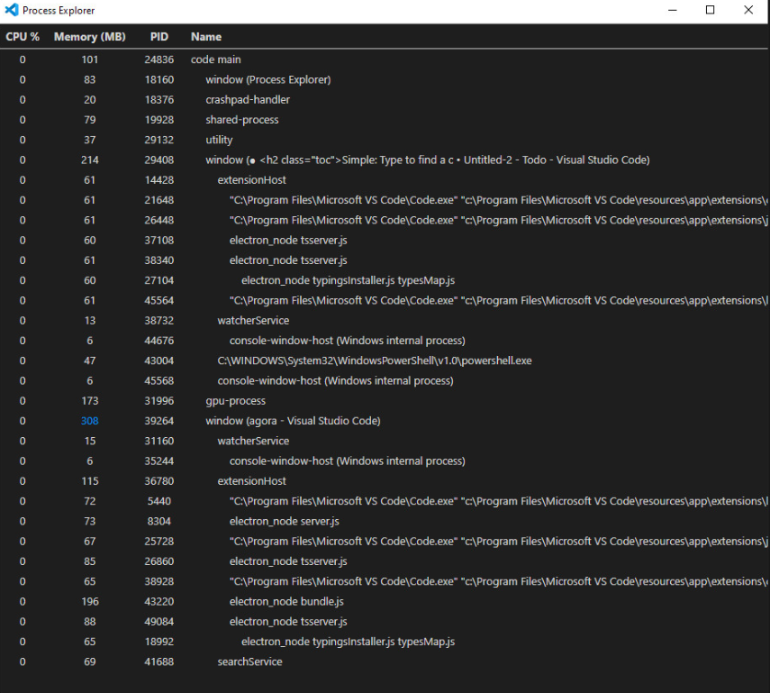

# VS Code Performance Optimizer

## Overview

The **VS Code Performance Optimizer** extension helps to make Visual Studio Code run faster and smoother on PCs with limited RAM and storage. It intelligently identifies and stops unnecessary processes running in the background, ensuring your system resources are optimized, and your coding experience remains seamless.

If you're using a PC with low memory or storage, this extension will help you minimize the resource footprint of VS Code, giving you better performance and responsiveness.

## Features

- **Stop Unnecessary Processes**: Identifies and stops processes that are not essential for your current workspace, saving valuable system resources.
- **Optimize RAM Usage**: Reduces the RAM consumption of VS Code by terminating non-critical background tasks.
- **Improve Performance**: Ensures that your PC runs more efficiently by keeping only necessary processes active.
- **Seamless Experience**: The extension works automatically to manage processes, with minimal input required from the user.

## Installation

### 1. Install the Extension

To install the **VS Code Performance Optimizer**, follow these steps:

#### Option 1: Install from the Visual Studio Code Marketplace

1. Open VS Code.
2. Go to the **Extensions** view (`Ctrl+Shift+X`).
3. Search for **VS Code Performance Optimizer**.
4. Click **Install**.

#### Option 2: Install from VSIX

If you have a `.vsix` file, you can install it manually:

1. Download the `.vsix` file.
2. Open VS Code and go to **Extensions** view.
3. Click the **...** (three-dot) menu in the top-right corner.
4. Select **Install from VSIX...**, then choose the `.vsix` file.

### 2. Enable the Extension

Once installed, the extension will automatically start optimizing VS Code’s performance by managing background processes. You don’t need to configure anything to start benefiting from it.

## Usage

The extension works automatically in the background.

## How It Works

The **VS Code Performance Optimizer** works by monitoring background processes and stopping non-critical tasks when necessary. This reduces the load on your system's RAM and CPU, allowing VS Code to run faster on devices with lower resources.

The extension automatically handles:

- **Background Tasks**: Stops tasks that are not critical for your current workspace.
- **Extensions**: If certain extensions are consuming too many resources, the extension can disable them temporarily.
- **Inactive Processes**: Stops processes that are idle or inactive but still consuming resources.

It’s designed to be as non-intrusive as possible, ensuring that you only notice an improvement in performance without dealing with constant management.

## Tips for Best Performance

- Keep your workspace lean by closing unused files and tabs.
- Disable extensions you don’t use frequently (you can re-enable them with a click if needed).
- Make sure you have enough free disk space and memory available on your system.

## Troubleshooting

- **Extension Not Optimizing Enough**: If the extension is not optimizing VS Code enough, try manually disabling extensions that are consuming high resources.
- **VS Code Performance Issues**: Ensure that your system has enough free memory and storage. If the problem persists, consider upgrading your hardware for a better experience.

## Contributing

Contributions are welcome! Feel free to open issues or submit pull requests.

### To contribute:

1. Fork this repository.
2. Create a new branch (`git checkout -b feature-xyz`).
3. Commit your changes (`git commit -am 'Add feature xyz'`).
4. Push to the branch (`git push origin feature-xyz`).
5. Open a pull request.

## License

This project is licensed under the MIT License – see the [LICENSE](LICENSE) file for details.
